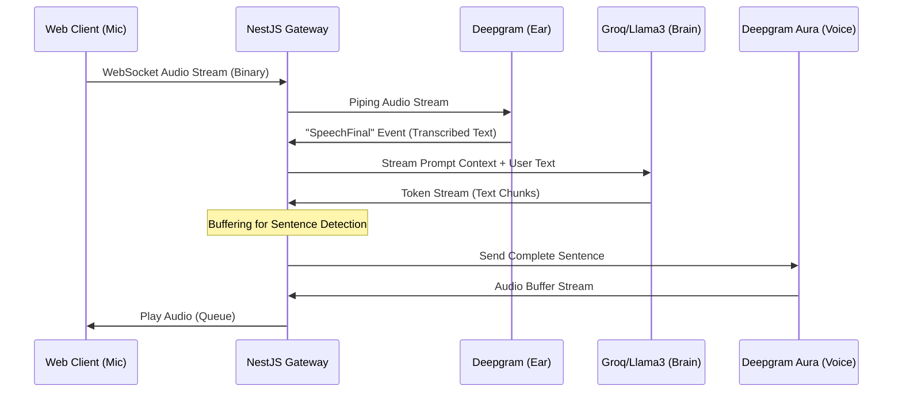

# Nexus Voice AI (POC) 🧪

### Cost-Efficiency Validation for Real-Time AI Sales Training

> [!WARNING]
> **Proof of Concept Context:** This repository is a **technical feasibility study** and **POC**. It is NOT the final production API.
>
> **The Problem:** Building a scalable "Sales Training with AI" product using off-the-shelf solutions like **OpenAI Realtime API** is financially unfeasible for this use case ($0.20+/min).
>
> **The Goal:** This POC demonstrates that by manually orchestrating specific, high-performance AI services, we can deliver a comparable real-time experience at a fraction of the cost.

---

## 🚀 The Business Case & Hypothesis

The core blocker for mass adoption of conversational AI in training scenarios is **Unit Economics**. This project was born from the need to validate if we can escape the "wrapper tax" of high-cost APIs.

*   **The Constraint:** Standard APIs cost ~$0.20/minute. For a training/education product with thousands of hours of usage, this breaks the business model.
*   **The Experiment:** Can we manually orchestrate **Deepgram** (STT/TTS) and **Groq** (LLM) to achieve similar latency?
*   **The Result:** We successfully demonstrated a reduction in costs to **~$0.025/minute** while maintaining **sub-800ms latency**.

| Metric | OpenAI Realtime API | Nexus Voice (Manual Orchestration) | Result |
| :--- | :--- | :--- | :--- |
| **Cost** | ~$0.20 / min | **~$0.025 / min** | **✅ Viable Unit Economics** |
| **Latency** | Excellent | **< 800ms** | **✅ Competitive** |
| **Control** | Locked Ecosystem | **Full Control** | **✅ Customizable** |

### Key Advantages Verified
*   **Economic Viability:** Proved that granular orchestration makes the product business-feasible.
*   **Realism:** Implemented full-duplex streaming with **"Barge-in" support**, allowing users to interrupt the AI naturally, mimicking real human conversation.

---

## 🏗️ Technical Architecture

This repository is a **Monorepo** containing the **API Gateway** (Backend) and the **Web Client** (Frontend).

### System Design

The system avoids standard REST bottlenecks by using **Bi-directional WebSockets** and binary streams for real-time audio processing.



### Core Components
*   **Orchestration Layer:** A custom `VoiceOrchestrator` in **NestJS** managing the conversation state machine (Listening -> Processing -> Speaking).
*   **Streaming Pipelines:** Utilizes **RxJS** and native **Node.js streams** to pipe audio data with minimal memory footprint.
*   **Interruption Handling (Barge-in):** sophisticated logic to instantly clear audio buffers and cancel LLM generation when the user speaks over the AI.
*   **Containerization:** Fully Dockerized environment using **Docker Compose** for consistent and seamless deployment.

---

## 🛠️ Tech Stack

### Backend (`/api`)
*   **Framework:** [NestJS](https://nestjs.com/) (Node.js)
*   **Communication:** WebSockets (`ws` adapter), Event Emitters
*   **AI Providers:**
    *   **STT (Hearing):** Deepgram Nova-2 (WebSocket Stream)
    *   **LLM (Brain):** Groq (Llama 3 70B - Token Streaming)
    *   **TTS (Speaking):** Deepgram Aura (Low Latency)
*   **DevOps:** Docker, Colima, Docker Compose

### Frontend (`/web`)
*   **Framework:** React / Flutter (Web)
*   **Audio Processing:** Raw PCM 16-bit audio capture and playback (Worklet-based)
*   **State Management:** Real-time socket state synchronization

---

## 📂 Repository Structure

```bash
nexus-voice-poc/
├── api/                 # NestJS Application (Backend)
│   ├── src/
│   │   ├── modules/
│   │   │   ├── gateway/       # WebSocket & Stream handling
│   │   │   ├── orchestrator/  # Conversation State Machine
│   │   │   └── ai-services/   # Adapters for Groq/Deepgram
│   └── Dockerfile
├── web/                 # Frontend Application
├── docker-compose.yml   # Infrastructure orchestration
└── README.md
```

---

## ⚡ Getting Started

### Prerequisites
*   Node.js v20+
*   Docker & Docker Compose (or Colima)
*   API Keys for **Deepgram** & **Groq**

### Installation

1.  **Clone the repository**
    ```bash
    git clone https://github.com/your-username/nexus-voice-poc.git
    cd nexus-voice-poc
    ```

2.  **Environment Setup**
    Create a `.env` file in the `/api` directory:
    ```env
    DEEPGRAM_API_KEY=your_key_here
    GROQ_API_KEY=your_key_here
    PORT=3000
    ```

3.  **Run with Docker**
    ```bash
    docker-compose up --build
    ```

4.  **Access**
    *   **API/Gateway:** `http://localhost:3000`
    *   **Web Client:** `http://localhost:5173` (or configured port)

---

## 🔮 Roadmap

- [x] **POC:** Audio Streaming & LLM Integration.
- [ ] **Latency Optimization:** Implement jitter buffer strategies.
- [ ] **Observability:** Add OpenTelemetry/Jaeger to trace latency spikes.
- [ ] **Scalability:** Migrate Gateway to Redis IoAdapter for horizontal scaling.

---

## Author

**[Seu Nome]**
*Full Cycle Software Engineer | Node.js Specialist*

[](LINKEDIN_URL) [](PORTFOLIO_URL)
