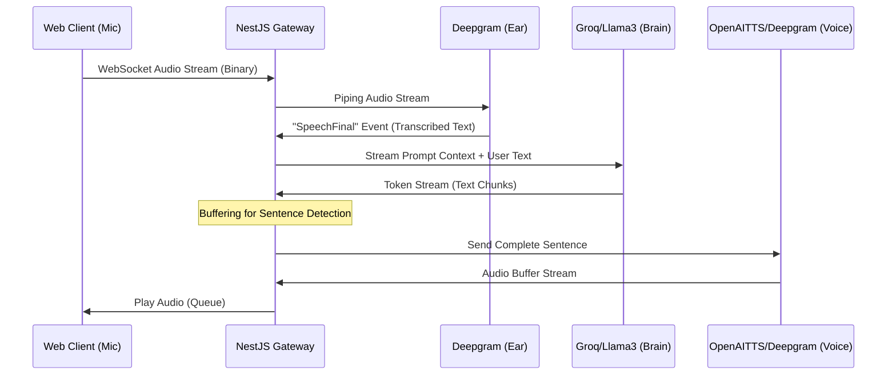

# Nexus Voice AI (POC) 🧪

### Cost-Efficiency Validation for Real-Time AI Sales Training

> [!WARNING]
> **Proof of Concept Context:** This repository is a **technical feasibility study** and **POC**. It is NOT the final production API.
>
> **The Problem:** Building a scalable "Sales Training with AI" product using off-the-shelf solutions like **OpenAI Realtime API** is financially unfeasible for this use case ($0.20+/min).
>
> **The Goal:** This POC demonstrates that by manually orchestrating specific, high-performance AI services, we can deliver a comparable real-time experience at a fraction of the cost.

---

## 🚀 The Business Case & Hypothesis

The core blocker for mass adoption of conversational AI in training scenarios is **Unit Economics**. This project was born from the need to validate if we can escape the "wrapper tax" of high-cost APIs.

*   **The Constraint:** Standard APIs cost ~$0.20/minute. For a training/education product with thousands of hours of usage, this breaks the business model.
*   **The Experiment:** Can we manually orchestrate **Deepgram** (STT/TTS) and **Groq** (LLM) to achieve similar latency?
*   **The Result:** We successfully demonstrated a reduction in costs to **~$0.025/minute** while maintaining **sub-800ms latency**.

| Metric | OpenAI Realtime API | Nexus Voice (Manual Orchestration) | Result |
| :--- | :--- | :--- | :--- |
| **Cost** | ~$0.20 / min | **~$0.025 / min** | **✅ Viable Unit Economics** |
| **Latency** | Excellent | **< 800ms** | **✅ Competitive** |
| **Control** | Locked Ecosystem | **Full Control** | **✅ Customizable** |

### Key Advantages Verified
*   **Economic Viability:** Proved that granular orchestration makes the product business-feasible.
*   **Realism:** Implemented full-duplex streaming with **"Barge-in" support**, allowing users to interrupt the AI naturally, mimicking real human conversation.

---

## 🏗️ Technical Architecture

This repository is a **Monorepo** containing the **API Gateway** (Backend) and the **Web Client** (Frontend).

### System Design

The system avoids standard REST bottlenecks by using **Bi-directional WebSockets** and binary streams for real-time audio processing.

---

## 📚 Documentation & Setup

To learn how to run the project, please refer to the documentation in the respective directories:

*   **Backend / API**: Access the `api` folder and check `api/docs/installation_and_implementation.md` for installation, environment setup, and architecture details.
*   **Frontend / Web**: Access the `web` folder and check `web/docs/installation_and_implementation.md` for running the React client.
